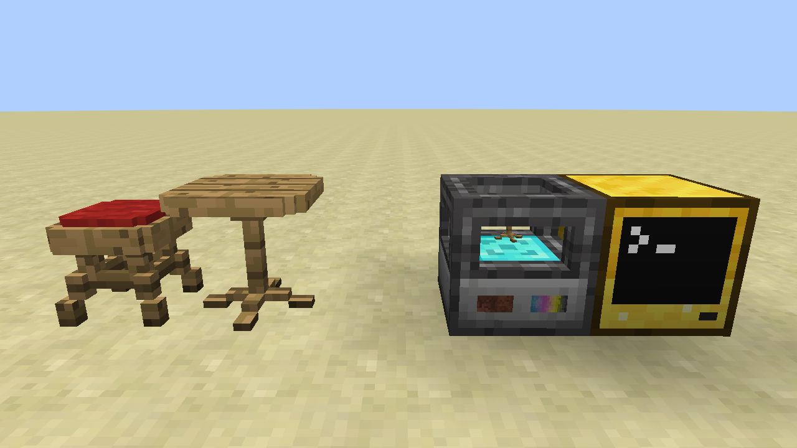

# sc-peripherals

Fabric 1.19 [CC-Restitched](https://github.com/cc-tweaked/cc-restitched) peripheral mod for the SwitchCraft server. 
The main feature currently is 3D Printers in the style of 
[OpenComputers](https://github.com/MightyPirates/OpenComputers).



## Modpacks

Modpack use: **allowed**

This mod (`sc-peripherals`) was created primarily for use by the SwitchCraft server, but you are **allowed** to use the 
mod in your own modpack.

Please note that each custom SwitchCraft mod has its own license, so check the license of each mod before using it in 
your modpack.

## .3dj format

The 3dj format was created as a more versatile alternative for processing and storing 3D models compared to the old
OpenComputers 3dm format. It uses JSON instead of Lua tables, so it is easier to work with programmatically.

There is an online .3dm to .3dj converter here: https://3dj.lem.sh/

#### Example

All arguments except for `shapesOff`, `shapesOn`, `bounds` and `texture` are optional.

```json5
{
  "label": "...",
  "tooltip": "...",
  "isButton": false,
  "collideWhenOn": true,
  "collideWhenOff": true,
  "lightLevel": 0,
  "redstoneLevel": 0,
  "shapesOff": [
    { bounds: [0, 0, 0, 16, 16, 16], texture: "", tint: "FFFFFF" },
    { bounds: [0, 0, 0, 16, 16, 16], texture: "", tint: "FFFFFF" },
    { bounds: [0, 0, 0, 16, 16, 16], texture: "", tint: "FFFFFF" }
  ],
  "shapesOn": [
    { bounds: [0, 0, 0, 16, 16, 16], texture: "", tint: "FFFFFF" }  
  ]
}
```

#### Fields

- `label`: (optional, string) The name of the 3D print, maximum 48 characters.
- `tooltip`: (optional, string) The tooltip of the 3D print in the inventory, maximum 256 characters.
- `isButton`: (optional, boolean) Whether the 3D print acts as a button when right-clicked. If true, the print will
  automatically switch to the 'off' state after 20 ticks when right-clicked. If false, right-clicking will toggle the 
  state.
- `collideWhenOn`: (optional, boolean) Whether the 3D print is collidable when in the 'on' state.
- `collideWhenOff`: (optional, boolean) Whether the 3D print is collidable when in the 'off' state.
- `lightLevel`: (optional, number) The light level of the 3D print. Must be between 0 or 15, but values above 7 will
  be clamped to 7 unless the print is later crafted with glowstone dust.
- `redstoneLevel`: (optional, number) The redstone level of the 3D print. Must be between 0 or 15.
- `shapesOff`: (**required**, array of objects) The shapes of the 3D print when in the 'off' state. Each object in the array
  must have a `bounds` property with the bounds of the shape, a `texture` property with the texture of the shape, and an
  optional `tint` property with the tint of the shape, which may be a number or a hex string (`RRGGBB`).
  - `bounds`: (**required**, array of numbers) The bounds of the shape, in the format
    `[minX, minY, minZ, maxX, maxY, maxZ]`. Numbers must be between 0 and 16 inclusive (16 is the edge of the block).
  - `texture`: (**required**, string) The texture of the shape, including the namespace. For example,
    `minecraft:block/stone` or `sc-peripherals:block/white`. Use the texture analyzer item to find the texture of a
    block in the world. The `sc-peripherals:block/white` texture is available as a blank texture for tinting.
  - `tint`: (optional, number or string) The tint of the shape, as a hex string in the format `RRGGBB`, or a single
    decimal value.
- `shapesOn`: (**required**, array of objects) Same as `shapesOff`, but for the 'on' state. To disallow state changes
  and have no 'on' state, pass an empty array.

  
## License

This repository is licensed under the [MIT license](LICENSE.md).
